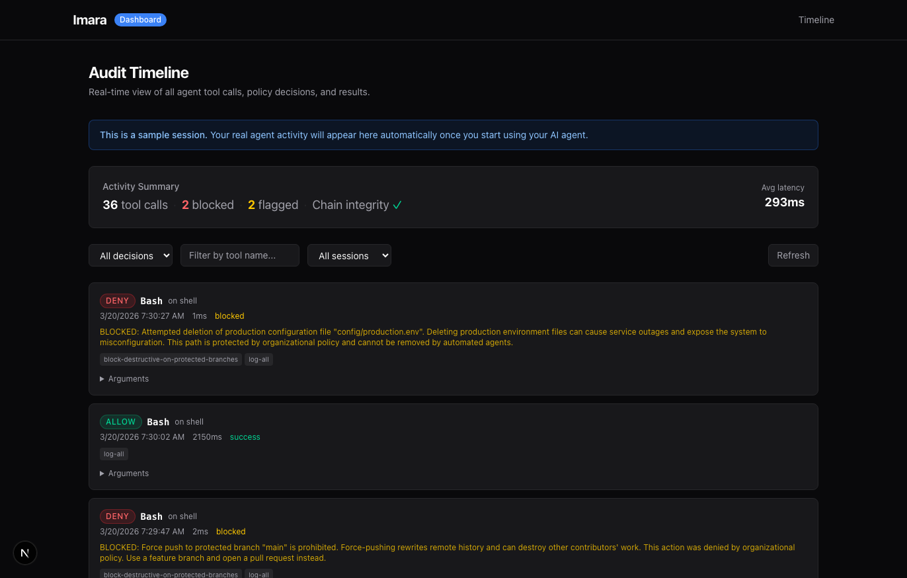

# Imara

[](https://www.npmjs.com/package/imara)
[](https://github.com/Dnakitare/imara/actions/workflows/ci.yml)
[](https://opensource.org/licenses/Apache-2.0)
[](https://nodejs.org)

**Policy enforcement for MCP agents.** Define rules in YAML. Imara intercepts every tool call, evaluates it, and decides: allow, deny, rate-limit, or escalate — before it reaches the server.

Ships with sensible defaults. Zero config changes to your agent.

```bash
npx imara
```



---

## Why this exists

AI agents now do real work: writing files, running shell commands, pushing to git, calling APIs. Most teams have no way to say "don't let the agent touch main" or "rate-limit writes to 20/minute" without forking the agent itself.

Imara solves this at the transport layer. Your agent is unchanged. The rules live in a YAML file you own.

**Timely context:** The EU AI Act's Art. 12 (automatic event logging) and Art. 14 (human oversight) obligations for high-risk AI systems take effect August 2, 2026. If you're deploying agents in healthcare, finance, HR tooling, or any system affecting consequential decisions, Imara's policy engine and audit trail cover both requirements out of the box.

---

## Get started

```bash
npx imara
```

This runs the full setup: initializes `~/.imara/`, patches your MCP config to route through the proxy, loads a demo session, and opens the dashboard at `http://localhost:3838`.

To add Imara to an existing project:

```bash
imara wrap    # patches .mcp.json or Claude Desktop config
imara unwrap  # restores the original anytime
```

---

## Policy engine

Rules are YAML files in `~/.imara/policies/`. Imara ships four default rules and evaluates them on every tool call, in priority order.

### Default rules

```yaml
# Block destructive operations on protected branches
- name: block-destructive-on-protected-branches
  priority: 10
  match:
    tools:
      - tool: git_push
      - tool: git_reset
      - tool: git_force_push
    arguments:
      - field: branch
        operator: in
        value: [main, master, production]
  action: deny
  reason: Destructive operations on protected branches are not allowed
  complianceFrameworks: [SOC2-CC6.1, SOC2-CC8.1]

# Rate-limit write operations
- name: rate-limit-writes
  priority: 20
  match:
    tools:
      - tool: write_file
      - tool: create_file
      - tool: edit_file
      - tool: "insert_*"
      - tool: "update_*"
      - tool: "delete_*"
  action: allow
  rateLimit:
    maxCalls: 20
    windowSeconds: 60

# Flag destructive operations for review
- name: flag-destructive-ops
  priority: 50
  match:
    tools:
      - tool: delete_file
      - tool: remove_directory
      - tool: git_push
      - tool: git_reset
      - tool: "drop_*"
      - tool: "rm_*"
  action: log
  reason: Destructive operation flagged for review
  complianceFrameworks: [SOC2-CC6.1]

# Log everything
- name: log-all
  priority: 100
  match:
    tools:
      - tool: "*"
  action: log
```

### Rule actions

| Action | Behavior |
|--------|----------|
| `deny` | Block the tool call. Returns a reason to the agent. |
| `allow` | Explicitly allow (overrides lower-priority rules). |
| `escalate` | Flag for human review. |
| `log` | Record the call without affecting the decision. |

### Matching

Match by tool name (exact or glob), server name, and argument values:

```yaml
- name: read-only-mode
  priority: 5
  match:
    tools:
      - tool: "write_*"
      - tool: "create_*"
      - tool: "delete_*"
  action: deny
  reason: Agent is in read-only mode
```

```yaml
- name: block-external-http
  priority: 15
  match:
    tools:
      - tool: fetch
      - tool: http_request
    arguments:
      - field: url
        operator: not_starts_with
        value: "https://internal.example.com"
  action: deny
  reason: External HTTP requests are not allowed
```

---

## Audit trail

Every tool call is logged to a local SQLite database with a SHA-256 hash chain. If anyone modifies the log, the chain breaks.

```bash
imara verify   # check chain integrity
imara tail     # stream events in real time
imara tail -f  # follow mode
```

For team deployments with multi-user attribution and richer session data, the audit store lives in [Mavryn](https://github.com/Dnakitare/mavryn). The two work together: Imara handles policy enforcement, Mavryn handles persistence and observability.

---

## Dashboard

```bash
imara dashboard
```

Opens at `http://localhost:3838`. Shows a timeline of every agent action, policy decision badges (allowed / denied / flagged), latency per call, and a risk summary for the session.

---

## CLI reference

| Command | Description |
|---------|-------------|
| `imara` | Full setup: init + wrap + dashboard |
| `imara init` | Initialize `~/.imara/` |
| `imara wrap` | Patch MCP config to route through proxy |
| `imara unwrap` | Restore original MCP config |
| `imara tail` | Stream audit events |
| `imara tail -f` | Follow mode |
| `imara dashboard` | Open the web dashboard |
| `imara verify` | Verify hash chain integrity |
| `imara status` | Show monitoring stats |

---

## How it works

```
Your Agent          Imara Proxy              Real MCP Server
    |                    |                        |
    |-- tools/call ----> |                        |
    |                    |-- evaluate policy       |
    |                    |-- log audit event       |
    |                    |-- tools/call ---------> |
    |                    |                        |
    |                    | <----- result --------- |
    |                    |-- log result + hash     |
    | <---- result ----- |                        |
```

Imara runs as a local proxy between your agent and your MCP servers. The agent sees the same tool interface it always has. No SDK changes, no agent config changes.

---

## Compliance mapping

| Requirement | Framework | How Imara addresses it |
|-------------|-----------|------------------------|
| Automatic event logging | EU AI Act Art. 12 | Hash-chained audit trail for every tool call |
| Human oversight | EU AI Act Art. 14 | `escalate` action routes calls for human review |
| Change management | SOC 2 CC6.1, CC8.1 | Policy rules with compliance tags |
| Access controls | HIPAA audit controls | Per-tool deny rules with logged reasons |
| AI management | ISO 42001 | Policy-as-code with versioned YAML |

---

## Install

```bash
npx imara
```

Or install packages for programmatic use:

```bash
npm install @imara/core     # types, schemas, hash chain
npm install @imara/policy   # policy engine
npm install @imara/proxy    # MCP proxy
npm install @imara/store    # local SQLite audit store
```

---

## Architecture

Monorepo with clean package boundaries:

- **[@imara/core](https://www.npmjs.com/package/@imara/core)** — types, Zod schemas, SHA-256 hash chaining
- **[@imara/policy](https://www.npmjs.com/package/@imara/policy)** — policy evaluation engine
- **[@imara/proxy](https://www.npmjs.com/package/@imara/proxy)** — MCP proxy with tool call interception
- **[@imara/store](https://www.npmjs.com/package/@imara/store)** — local SQLite audit store
- **@imara/dashboard** — Next.js web UI

---

## Roadmap

- [x] MCP proxy with transparent interception
- [x] SHA-256 hash-chained audit trail
- [x] YAML policy engine with glob matching and rate limiting
- [x] Real-time dashboard with timeline view
- [x] Zero-config `imara wrap` / `imara unwrap`
- [ ] `imara policy test --tool <name> --args '{...}'` — test rules without running the proxy
- [ ] Compliance report export (EU AI Act Art. 12 + Art. 14)
- [ ] Human-in-the-loop escalation workflows
- [ ] SSE/WebSocket MCP transport support
- [ ] Team mode via [Mavryn](https://github.com/Dnakitare/mavryn)

---

## Development

```bash
git clone https://github.com/dnakitare/imara.git
cd imara
pnpm install
pnpm build
node packages/cli/dist/cli.js
```

See [CONTRIBUTING.md](CONTRIBUTING.md).

## License

Apache 2.0 — see [LICENSE](LICENSE).
